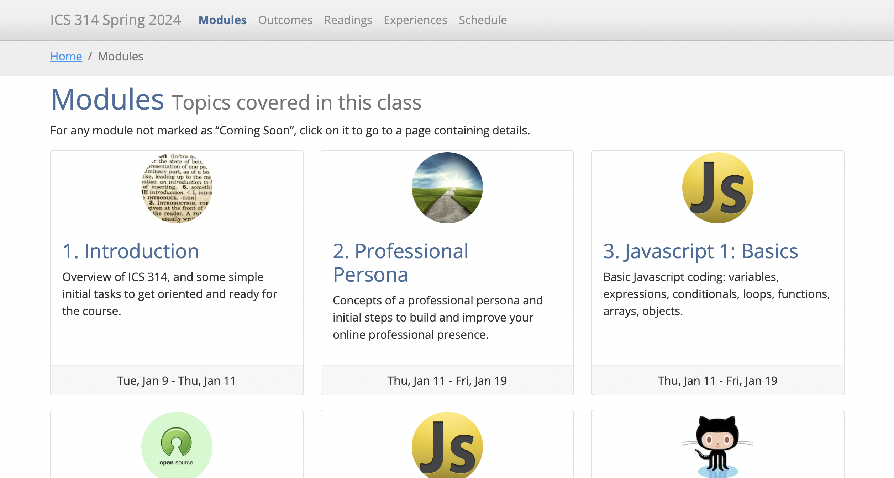

### Introduction
With my spring 2024 semester at UH Manoa coming to an end, so does my experience and time with ICS-314. And now looking back, I was able to expand what I’ve learned in previous courses and apply them to scenarios that I’ll possibly be dealing with in the new future. It was also nice to get some experience with new coding languages that have a focus on web development like HTML, CSS, and JavaScript. Then from there branching out to things like the UI Frameworks Bootstrap and React, working alongside with MongoDB database and web application frameworks like Meteor. I feel like I’ve learned  a lot, but at the same time know that I’ve only dipped my toes into software engineering with web development. It’s piqued my interest and makes me want to possibly expand my knowledge in this specific field in the future. 

Now, thinking about the fundamental software engineering concepts that we’ve learned throughout the course, there’s a couple that really stick out to me. But I’m saying the others are irrelevant! Each concept is important, focusing on different aspects of the process of software engineering while all having the same goal of improving your skills in software development. 

### Agile Project Management
The first concept that I want to talk about is Agile Project Management. During this subject we learned about how this concept focuses on improving the process and efficiency of software development when working within a group. Since working within any type of group, large or small, Agile Project Management provides structures that developers can use to help collaborate with others more efficiently while improving planning for future tasks that need to be addressed. This is good to address since there are many aspects that can affect the prosses of development like the size of the group, personality of the team members, characteristics of the project, etc. So having a structure for everyone in the group to follow will allow things to be more organized while making sure everyone knows the tasks that they need to work on while knowing what everyone else is working on. 

The style of Agile Project Management that we used for our group project we’ve been working on for the last couple months is Issue-Driven Project Management.  The way this style was described to us is that Issue-Driven Project Management (in simplest terms) follows these rules:

  -	Divides up the work into tasks.
  -	No task takes longer than 3 days.
  -	Each task is specified by an issue.
  -	Each issue has a single owner.
  -	Issues are organized into Milestones.
  -	Milestones have due dates.
  -	Milestones are represented by Project Boards.
  -	At all times, every person has at least 1 issue that they are responsible for closing.

We practiced this concept using GitHub and while it took a bit to get used to how everything works, I can easily see how using this kind of approach to project can really improve the efficiency of workflow for each person in the group. Of course, I’m not a pro yet, but with software development being something that I want to pursue in the future, this is something that I really want to improve on. Gaining experience with Issue-Driven Project Management while working on our group project made me see how this is something that I can see myself using in the future when it comes to working on any type of project. This concept helps with keeping confusion within the group to a minimum and allows everyone to work as efficiently as possible with each other, keeping everything in check. 

### User Interface Frameworks
The second fundamental software engineering concept that stuck with me is User Interface Frameworks. UI Frameworks provide a set of CSS classes and/or JavaScript functions that simplify the development of the layout, provide an attractive look-and-feel, and help provide consistent results across multiple browsers. As a mentioned earlier, front-end web development was new to me this semester and is something that I might want to keep working with in the future. I feel like it is something that would be good to know in any job that I might be doing since everything interacts with the web in some shape or form.  

During this semester, we were able to get experience with UI Frameworks like Bootstrap and React. In the beginning we work with redesigning existing websites to get used to how Bootstrap and React classes and functions work. Then when it came to our final project, we had to apply what we’ve learned when creating a functional website. The UI frameworks really helped with making a user interface that was clean, and easy to navigate through. Even with the surface-level experience that was used for our project, I can see just how useful UI frameworks can be when companies create UI for their websites. This is something that I see myself coming across again soon and I hope to improve my knowledge of UI frameworks to be able to confidently work with them in the future. 

### Final Thoughts
In conclusion, I want to mention all the other fundamental software engineering concepts that we learned which are Open-Source Software Development, Configuration Management, Functional Programming, Development Environments, Coding Standards, Design Patterns, and Ethics in Software Engineering. All of them were fascinating to learn about and I feel were crucial to know when it comes to the learning process of software development. I want to become a developer who can be easily collaborated with and can carry my own weight when it comes to working on a project with a team. Now knowing all the concepts we learned this semester in ICS-314, I hope to carry them throughout my future career in the tech industry and at the same time, I want to also expand my knowledge of each concept as I gain new experiences along the way. 
