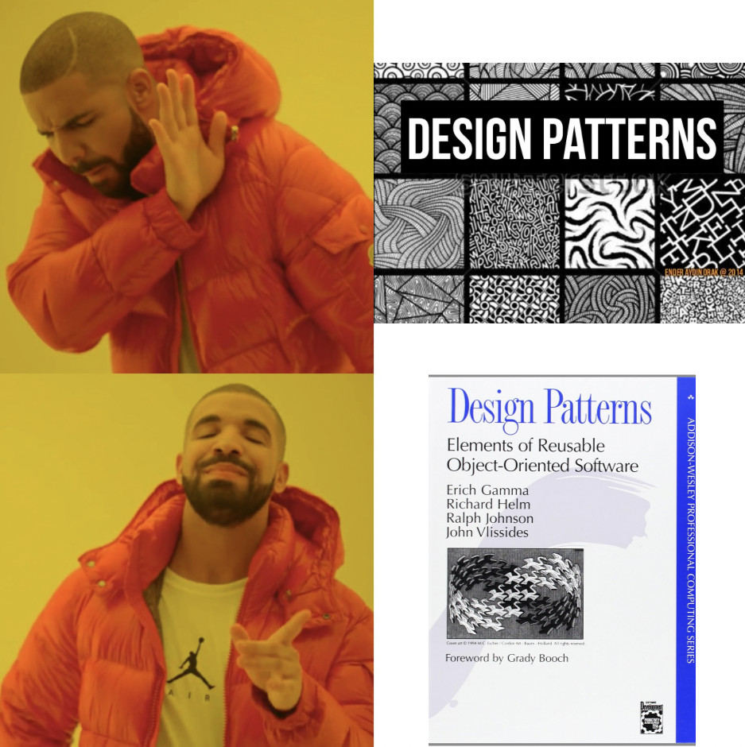

## "Oh, Not That Kind of Design Pattern"

I would like to start off by stating that during my Spring 2024 semester at UH Manoa, I’m one of those people whos been using design patterns and not realizing that we have been using design patterns all along (Shame on me!). BUT, I have a valid excuse! It was all a part of the learning process! We were exposed to design patterns and getting experience with them first so that later, it will make more sense when learning about the concept of design patterns. Or maybe I heard my professor wrong, being a selective listener to where it would justify me not knowing the difference between “Pattern Designs” (like on a rug)  and “Design Patterns” (the cool one, because now I know what it is). 

## "It All Makes Sense Now!"

After learning about what the concept of design patterns is for, it made me think of [this old video](https://youtu.be/6HRjTeM4N80?si=sGlVWJjag2a5XGsq&t=3) of this man who was cleaning a travelator in an “efficient” way. Okay, maybe not efficient since he only covered the top half of the glass. But that solution was a simpler way (in a sense where he didn’t have to move) for a problem that all the cleaners at the airport had to deal with and walk all the way down and back to clean. Those travelators can also be quite long. According to [this website](https://www.dimensions.com/element/moving-walkway-inclined-double#:~:text=Inclined%20pit%20depths%20are%20commonly,(100%2D200%20m)), a typical length is 100 meters – 200 meters. That's the most random thing I had to look up today. Now both of us learned something new about travelators today!

The structure of his solution can be passed to other workers where they can use his solution to the reoccurring problem. While using that man’s solution, they can use it in different ways to get the cleaning done in a more efficient way. That might be too much of a stretch, but that’s where my mind is making the connection to design patterns. In software development, design patterns try to elevate it by providing standardized solutions to reoccurring problems. While I’m so focused on learning and applying the coding practices that were given, I didn’t stop to think “Hey, where did this solution that I’m just plugging in come from?” I never realized that I have been experiencing design patterns up until now.

During this semester, one case that stood out to me is the use of a singleton design pattern from an example website Bowfolios created by our professor, Philip Johnson. For our final project, we are also using the same solution of creating a single instance of a MongoDB collection to be used throughout the whole application. It really helps with implementing the collection in different parts of our application by grabbing data from it or making changes to that collection. To respond to professors comment about the singleton design pattern in this video about Bowfolios at [17 min 48 sec](https://youtu.be/yP-t44HBCPQ?si=gzAlzOiCu_4V5scm&t=1068), yes, it is very cool and also very useful!

## "Looking Ahead!"

I’m very intrigued by the whole concept of design patterns, and learning about the Creational, Structural, and Behavioral design patterns. Although, I’m still trying to wrap my head around some of the concepts and applications of certain design patterns. The overall goal and meaning behind design patterns, where in layman’s terms are established resolutions for repetitive challenges in software development, is something that I never really thought about during my college career. Well, until now that is.
