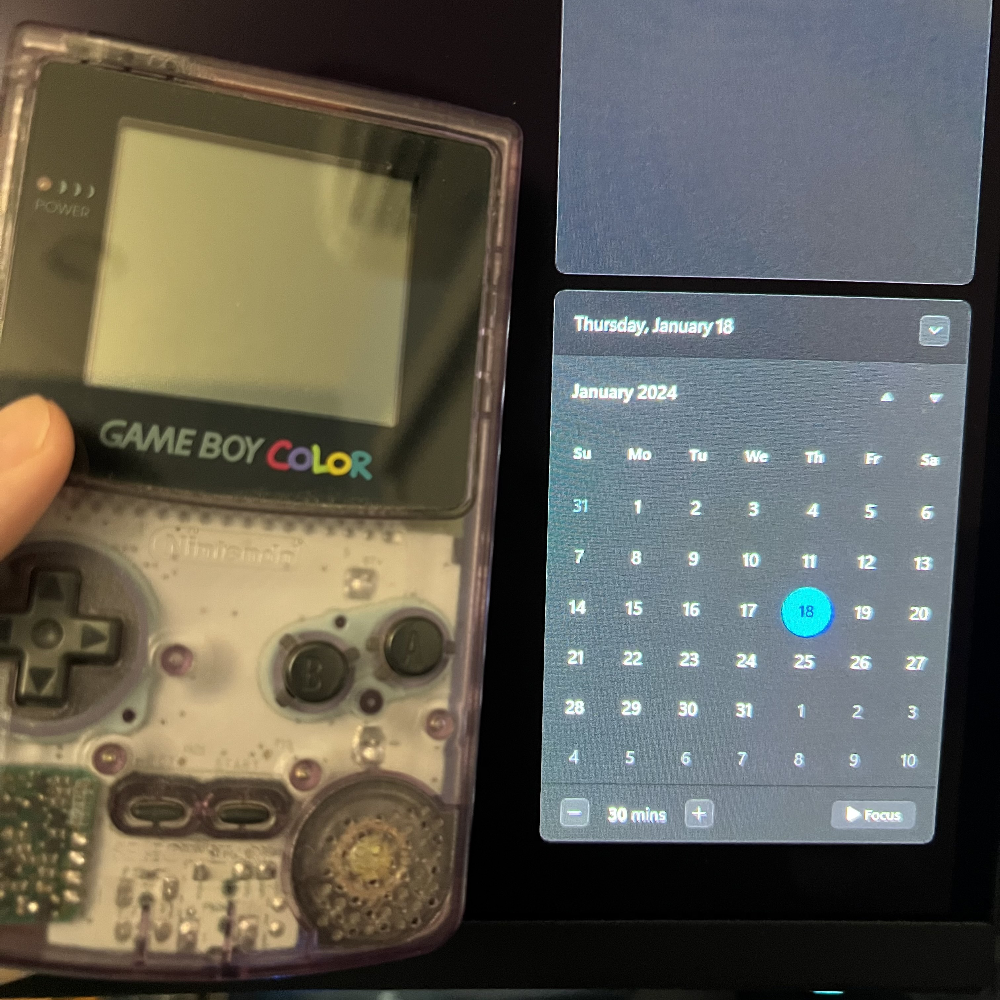

## Where it Began
It all started when I got a Gameboy Color for my birthday when I was little. I loved it so much I took it everywhere I went. Except for school because I was told that I might get it stolen. I think my parents just wanted me to not get distracted (and you just weren’t allowed to bring those kinds of things), but I listened since I didn’t like the thought of losing it. As years went by, my love for games never left and I got into new consoles and handhelds.  The Gameboy Advance, GameCube, DS, PSP, PlayStation 2, Wii, PlayStation 3, PS Vita, 3DS,  Wii U, PlayStation 4, Nintendo Switch, and finally PC.

Now, what does all that have to do with my future career in the tech industry? I’ve always had an interest and experience with some sort of tech as I grew up. At some point I started thinking about how fascinating it is to be playing games in all those different ways. Also, how it is so easy now to play and talk with friends and/or random people who live nowhere near me. But it’s not only games. From things like using Spotify on my phone for music and getting recommended new songs based on what I listen to, to things like accessing and navigating through websites on my computer. When I just sit down and think about it for a second, it just seems bizarre how we’re able to do all these kinds of things. That is why I decided to start working toward a career in the tech industry.

I’m still trying to think about what specific field I want to pursue. Right now, I’m focusing on software development, but I also have an interest in cyber security and artificial intelligence. Taking ICS-314 this semester, I’ll be able to experience assignments that are closer to “real world” scenarios where I’ll have to apply what I’ve learned in new ways that I’m unfamiliar with. By the end of the semester, I want to be able to have a clear mind when working under pressure. This is something that hasn’t prevented me from completing an assignment, but the pressure and frustration has hindered my thinking when my code does something I was not expecting. Being able to deal with those feelings, I also want to improve my critical thinking and be able to work fast and efficiently. Teamwork is another skill that I want to improve. I like working and communicating with others because it’s beneficial to see everyone’s way of thinking and allows me to learn different solutions to a problem that I didn’t even think of.  Developing and improving these skills can only help me in the future and I hope I can continue to keep taking steps forward, one at a time, towards a successful career in the tech industry.
