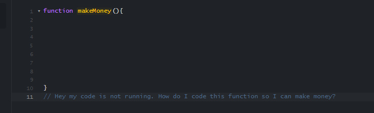
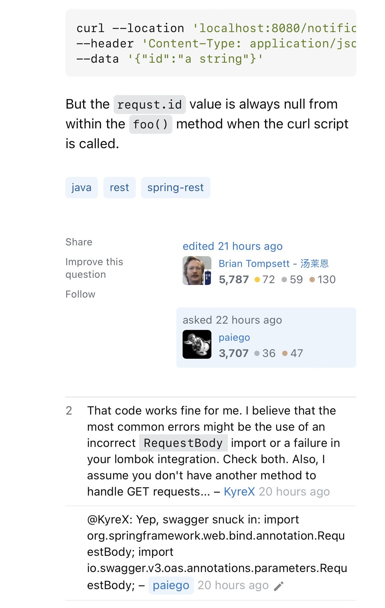

## How do I type this essay?
We all know the answer to the question “Is there such a thing called a bad question?”. Ignoring the bad question in the header, I’ll be honest and admit that I have asked probably a good number of bad questions…in non-professional scenarios though! But why does it matter depending on the scenario? Well, when I think about it, the times I ask these “bad questions” is with friends or family-members. But the circumstances change drastically when it comes to asking questions in a completely different scenario, say like online with random people in a forum community like Stack Overflow.  

## No effort
What is a bad question? After reading the article from Eric Raymond about [smart questions](http://www.catb.org/esr/faqs/smart-questions.html), I noticed that a there are a lot of things that contribute to a “bad question”.  There was one aspect mentioned that really sticked out to me. That a bad question is when a person doesn’t put in any effort themselves to try and get to the desired solution. Instead, they ask a very broad question that requires more time from the person trying to help and find the solution. 

In the article, Eric mentions that people who ask these questions will pretty much get shunned by many others in the community. That makes sense when you think about it. People who’re in these online communities helping each other are not getting paid or are there for an obligation. They made their own decision to make time in their busy life to help out and solve random peoples’ problems. Then when someone asks a question where it’s obvious that they have not tried to solve it on their own and barely provide any details to help figure out what the problem is, they get hated on and/or don’t end up getting the solution to the problem. 

## The good and the bad

Here is an example of a [bad question](https://stackoverflow.com/questions/77877124/how-can-i-plot-this-function-to-see-what-it-looks-like) and a [good question](https://stackoverflow.com/questions/77883210/simple-json-parsing-not-working-in-post-to-spring-api#comment137303910_77883210) from Stack Overflow. It’s easy to see the difference between the two questions. In the “good question”, the user provides snippets of his code and details explaining what was going on and why it was a problem. At the time of writing this essay, he was able to get the solution from one other user that was familiar with that problem in about an hour. Versus the “bad question” where the user states he doesn’t know how to code and is asking for someone to pretty much do it for him. Then almost a day later, still has not found a solution.

  
  
  
  

  
## The solution 
What I’ve learned form this is to not be THAT person to my friends and family. I have to stop asking them how something works before even trying to read the manual or just looking for a shortcut. In all seriousness, I learned a lot about the different forms of questions and now understand more as to why it is difficult to ask a good question. It’s difficult BECAUSE it’s so easy to ask a bad question.  But being mindful of all of this can help me improve on how I ask questions if I put the effort in and make sure that I won’t be that person in my workplace or online in the future. 
