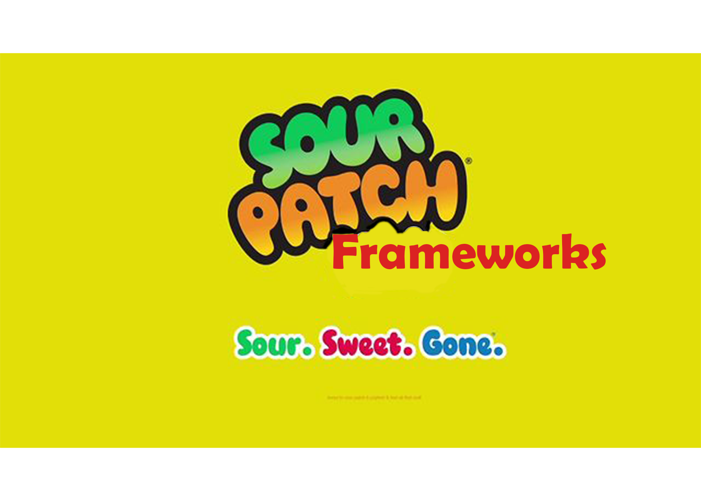

## "First they're sour."

Do you remember the Sour Patch Kids commercials, where the Sour Patch Kids start off with doing something bad/mean to a person, but then later, they start to apologize or be nice to make up for their wrong doings?  Oh, and the guy saying “First they’re sour. Then they’re sweet” and then closing off the commercial with the slogan “Sour. Sweet. Gone.” I don’t really watch TV anymore, so I have no clue if they’re still doing those kinds of commercials for Sour Patch Kids. But many years later, the commercials are still doing their job since I still remember them clear as day. Which is also making me want stop typing this essay and go buy some right now. 

But staying on track, when I think about my experiences so far with UI frameworks (Bootstrap 5), it’s like I’m in one of those Sour Patch Kids commercial, with Bootstrap 5 being the Sour Patch Kid bullying me. I’m in the middle of that “sour” phase and just waiting for the “sweet” where the “bullying” can stop. Then Bootstrap 5 and I can become best friends. But instead of UI frameworks being “Sour. Sweet. Gone.”, I’m hoping that it’ll be “Sour. Sweet. Stay with me and make HTML easier to use in the future.”

## "Then they're sweet."

Okay, that’s enough with being a bit dramatic. But as you can tell from my statements earlier, it has been a bit of a rough start with UI frameworks. Though, I’m starting to understand Bootstrap 5 little by little. And it’s not just with UI frameworks, but also with HTML. Prior to the past couple weeks, I had no experience with HTML or CSS and learning about it has been very interesting to see what goes on with developing a website. Seeing and/or using amazingly, well-crafted websites always amazed me. I knew that building a website wouldn’t be that easy, but now I give web developers even more credit. I’m still trying to get used to HTML and understand all the intricate details, which I know isn’t going to just happen overnight. Then learning how to use UI frameworks like Bootstrap 5, which enhances the user experience with new ways to code in HTML, will also just take a bit for me to get used to. 

Even though I’m still in the “sour phase”, I can easily see the “sweet phase” and how it really improves the user experience when developing a website. With UI frameworks being prewritten code of UI components and interfaces, it can allow developers to create nice looking websites quicker and easier. From what I can tell so far, HTML has a lot of attributes that contribute to each element of a website. So being able to use custom classes provided by a framework just allows you to get the result that you want with shorter steps. But of course, you must learn how to use the UI framework first, and that’s the obstacle that I’m currently facing. 

## "Not Gone."

With all of that said, I will continue to put a lot of effort into learning not just UI frameworks, but also HTML and CSS. Before these past couple weeks, I didn’t know how it felt when you’re on the other end, being a developer who created a beautiful website that many people enjoy using. Well…I still don’t know that feeling. BUT, doing assignments like the pictures below where we had to pick a website and kind of recreate it (didn’t need to be exactly one-to-one), it felt satisfying to get a result that I was trying to reach. Sort of like that same feeling when you get a program working the way that you wanted it too. If it felt like that for just a small assignment in college, I can’t imagine how nice it must feel building a masterpiece for many people to enjoy. 
