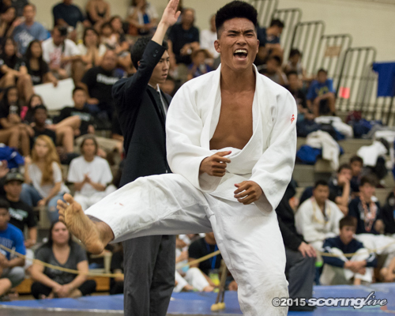

I joined the Kapolei Judo Club in 2015 and 2016 after being recruited by my friends, with Kekua(above) being one of them. 

We had practice everyday after school during the season with sparring, weight training, and cardio being the focuses for our practices. 

I participated in tournaments throughout the season and won some matches, but didn't place in the top 3 of my weight class. Going against someone who's been doing Judo for years really shows and with just joining, I was content with the wins that I achieved. 

What I've learned from this is that I always thought of Judo as an independent sport. While a lot of it is individual performance, it is still a team sport. Improving myself wasn't just for me, it also helped others on the team by learning new things through practice and sparring sessions. It changed my view and allowed me to see the weight of teamwork in something I thought was more focused on individual performance. It gave me more motivation to improve myself, not just for me, for the others on the team as well. I was able to learn how important everyone's role is in a "team" environment.

Here's an article about the 2015 Judo OIA
 
Source: <a href="https://github.com/theVacay/vacay">theVacay/vacay</a>
