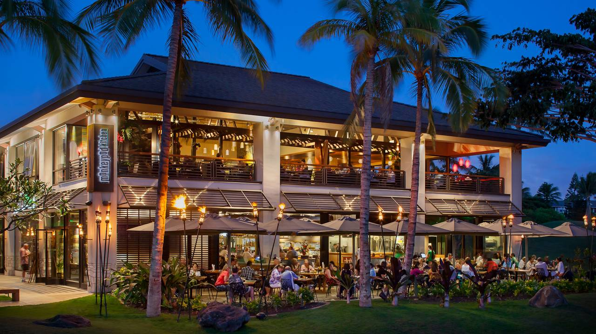

MonkeyPod Kitchen in Ko'olina is across the street from all the hotels that line up along the beach. Tourism is big in Hawaii, and being in Ko'olina, MonkeyPod is busy most of the time. 

I was the Expo on the food line who's in charge of communicating with the chefs and making sure everything was organized for the food runners to know which table to take the food to. The most challenging scenario while working there was when it rained. In the photo, you can see a lot of tables are outside and there are no windows to enjoy Hawaii's wonderful weather...that is when it isn't raining. When it does, we would accommodate each guest affected by the bad weather and move them to another table. But if they had orders, the server would update me with the new tables. Since the orders were already put in and the table number could not be changed, I had to remember all the new tables for each order and make sure everything stayed organized to still send the right orders to all the tables that moved. If the restaurant was filled at a time like that, just imagine the chaos. 

Working here gave me experience with working under pressure and taught me how to stay composed under those circumstances. I needed to constantly communicate with my co-workers to make sure we were all on the same page and I had to keep everything organized so that the right food went out when it needed to. I also had keep track of which orders to prioritize depending on the time and check in with the chefs and servers to talk about any modifcations requested by a table.

This experience has taught me many skills that will help me in any career in the future. I had a good time and wouldn't mind working in the restaurant industry again. 
