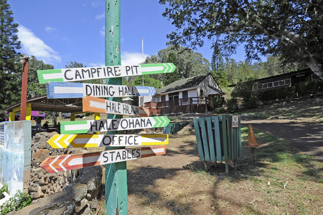

During the summer, there's a program that brings over a hundred people to stay at Camp Pālehua (Makakilo) for two weeks. 

My culinary teacher from high school would help run the kitchen and I volunteered to help during this time because I enjoy cooking and thought it would be fun. I also felt that it would be a good experience to do volunteer work to gain new skills and be in a new environment.

I helped with cooking breakfast, lunch, dinner, and serving to the people staying there. This experience allowed me to learn how to work with others that I only just met and being felxible to help where it was needed. Communication was also important to make sure that things were done at the right time and that everything was ready when people came in to eat. That was also a bit stressful for me because I wanted to make sure I stayed focused and work at a fast pace, but also working efficiently. I wanted to carry my own weight and not slow the others down for making a mistake that was easily avoidable. 

What I've learned from participating is that don't just think about the task that you're doing. Also thinking about what you can gain from the experience. Like this for example. Even though cooking isn't really related to Computer Science at all, the skills gained from the experience can easily be transferred over. I always like to put in 110% effort in anything that I do, and try to reflect on what I've learned and how I can use it in the future. Communication and flexibility goes a long way in any career and I'm always eager to improving those skills and this experience helped contribute to improving my skills.
