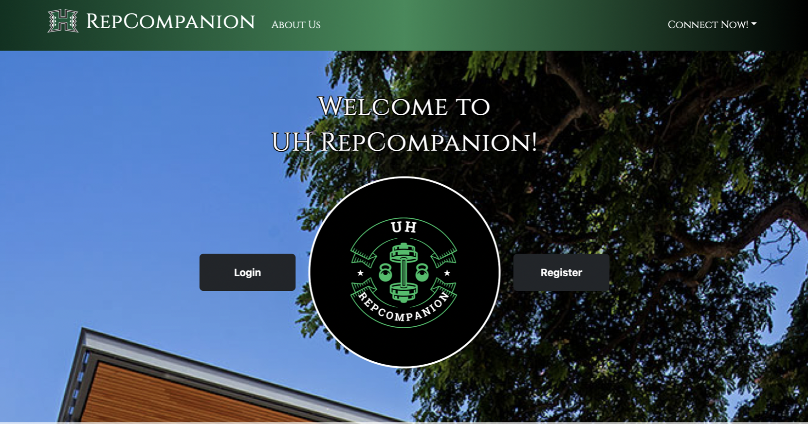

With this final project being the first one that closely resembled what I could experience later in the tech industry, it was an eye-opener. I’ve learned so much when going through the full process of creating and deploying a website from start to finish. Looking back at it now, we started with a pencil and paper when our group was brainstorming ideas on what we wanted our site look like and what we wanted the user experience to be like. Seeing drawings of very scuffed pictures with vague descriptions evolve into a working website is an experience that I’m glad to have. Here’s the [project page](https://uh-repcompanion.github.io) for our project to see what it looks like. 

But to give a short summary, UH RepCompanion is geared towards allowing students at UH Manoa to find others to workout with. This tackles the issues of people wanting to workout with others but are not able to in scenarios like all their friends having no interests in working out. Having others with you while you work out is beneficial to not only being able to socialize, but also being able to motivate one another and being there to spot each other when needed (safety first). 

In UH RepComapanion, users can create events to show other users what workouts they’re planning to do soon and allows them to request to join those workouts if it falls under their same interests. Users can also view each other profiles to see things like interests, or their major to have a better understanding of each other’s personalities and goals they’re trying to achieve. 

I think the most challenging part about this project was working with the databases and making sure that all the collections were working properly with one another. As we were going through the process, there were many times where pages were not displaying because something was wrong with how that page was receiving the data from the collections. So, there were just many scenarios where we had to do some troubleshooting based on the collections. But I’m glad I was able to experience all of that because it allowed me to get a better understanding of how collections work. I can carry that knowledge with me and hopefully expand on it so that I can work with them more confidently. 

Of course, I wasn’t working alone on this project. I’d like to thank [Anthony](https://t-tirabassi.github.io/), [Justin](https://jenativi.github.io/), [Veronica](https://veronicaparayno.github.io/), and [Brandon](https://bksnelson.github.io) for being awesome to work with. This project was a good experience where I hope to take what I’ve learned about software development and improve on it in the future course that I’ll be taking in the few semesters I have left at UH Manoa. Learning how to work with others and making sure everyone is on the same page is an important skill to have when working on any project. For software development, you really want to make sure that that is the case because one small misstep can cause the whole app to stop working…speaking from experience. So now I have more experience with the DO’s and DON’Ts and hope I can continue to improve my skills for software development.  
